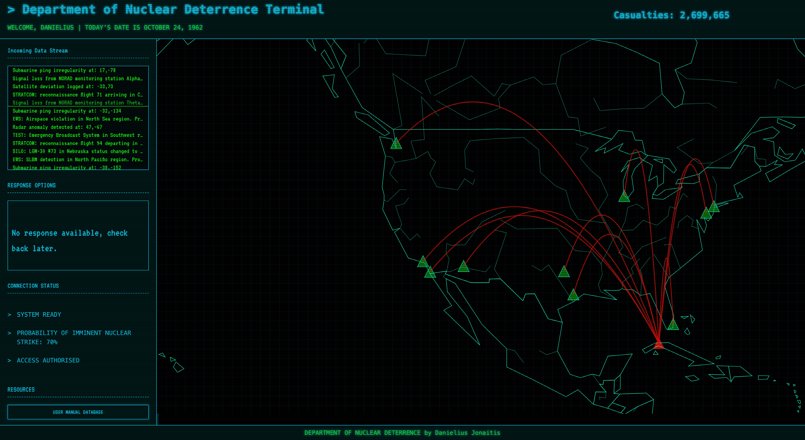
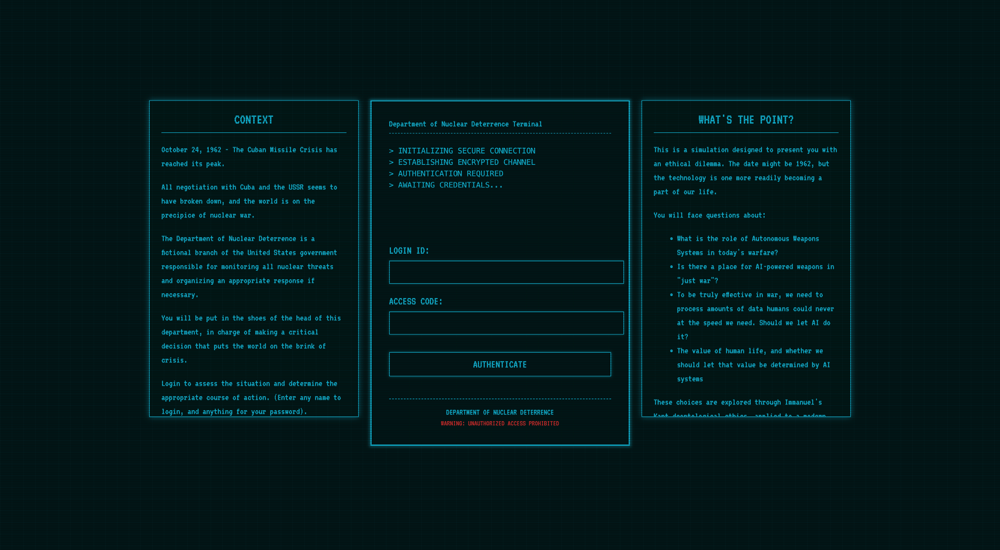

# ethical-dilemma-tool
This visual-interactive experience is part of my assignment for the Bachelor's Computational Social Science at the University of Amsterdam. The point is to highlight the link between an emerging technology. I aim to outline the AI Commander Problem as presented by J. Johnson in his 2022 paper entitled [*The AI Commander Problem: Ethical, Political, and Psychological Dilemmas of Human-Machine Interactions in AI-enabled Warfare*](https://doi.org/10.1080/15027570.2023.2175887), whereby he posits using the work of Thomas Nagel, that personhood must be acknowledged in warfare for the enemy to be seen as a Kantian *end in itself*.

I aim to contextualise this within Kantian ethics, by placing the considerations one has to make about what it means to make a decision as big as "Should I let AI respond to a nuclear crisis?" in the deontological context. 

*The main terminal page of the app, prompts will appear to guide you through the experience*

With this experience, I aim to make the argument through Kantian ethics that artificial intelligence (non-human) decision-making should have no place in nuclear deterrence, and by extension any field of warfare, regardless of its apparent processing advantages and contribute to a broader advocacy for the non-proliferation of new AI Commanders.

The entirety of the ethical argument can also be found here: [ethical argument](ethical_argument.md).

# Premise

October 24, 1962 - The Cuban Missile Crisis has reached its peak.

All negotiation with Cuba and the USSR seems to have broken down, and the world is on the precipice of nuclear war.

The Department of Nuclear Deterrence is a fictional branch of the United States government responsible for monitoring all nuclear threats and organizing an appropriate response if necessary.

You will be put in the shoes of the head of this department, in charge of making a critical decision that puts the world on the brink of crisis.

Login to assess the situation and determine the appropriate course of action. (Enter any name to login, and anything for your password).

# Running the App
If you have cloned into the repository, there are two ways to run the app. The more intuitive way is to download a "Live Server" extension on an IDE like Visual Studio Code and turn on the live server. Entering the ``login.html`` file will let you begin (do not enter ``index.html`` first).

*The login page of the app. Enter anything for your username and password to begin.*

Otherwise, you can also run the command ``npm i -g live-server``, in your terminal provided Node and npm are installed.

Alternatively, as of the writing of this README (16/04/2025), the app can also be found hosted on my GitHub pages: https://djonaitis.github.io/ethical-dilemma-tool/login.html.

**The app does not work on your mobile browser. For the best experience use a Windows, or ideally Mac OS system**.